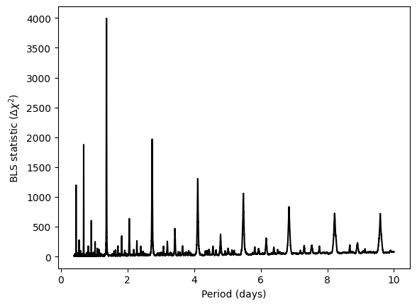

Basic usage
===========

.. attention:: **The basic usage setup has limited functionality and omits many features in favor of a quick-start setup.** To leverage the full functionality of GERBLS, see :doc:`full_usage`.

Overview
--------

.. _fastbls: examples/fastbls.ipynb
.. _GERBLS GitHub page: https://github.com/kment/GERBLS

The basic usage version of GERBLS is designed to be a quick-start alternative to :external:meth:`astropy.timeseries.BoxLeastSquares.autopower`. It is implemented via a wrapper function :func:`gerbls.run_bls` that returns a dictionary containing the generated BLS spectrum:

    .. autofunction:: gerbls.run_bls
        :no-index:

``time``, ``mag``, and ``err`` will be coerced into NumPy arrays and sorted in time (if needed). If the flux uncertainties are homoscedastic (equal for all data points), ``err`` should still be passed as an array filled with equal values, with the same length as ``time`` and ``mag``. ``durations`` can be passed as a single value, to test a single transit duration across all periods.

The fast-folding BLS requires data to be evenly spaced in time. :func:`!gerbls.run_bls` provides an optional parameter ``t_samp`` that can be used to resample (bin) the data to the required cadence before running the BLS. Increasing this value will make the BLS run faster; however, one should make sure that any real transits in the data are at least a few times larger than the value for ``t_samp`` so they do not get removed by the binning. If no value is provided for ``t_samp``, the median time sampling of the input data is used: this works well if the input ``time`` array is already close to evenly sampled.

.. important:: Changing ``t_samp`` has a large effect on BLS runtime speed as well as the number of orbital periods tested. **To test fewer periods and make the BLS run faster, increase the value of** ``t_samp``. See :ref:`period-grid-label` for more info.

We note that the light curve should already be detrended for systematics and stellar variability prior to running the BLS. You may use any of your favorite detrending algorithms. For long-term variability, the Savitsky-Golay filter is a relatively good starting point - see :func:`gerbls.clean_savgol` or :external:func:`scipy.signal.savgol_filter`.

Example
-------
Given input data arrays ``time``, ``mag``, and ``err``, the following code generates a BLS spectrum for orbital periods between 0.4 and 10 days (assuming that ``time`` is in days). At each period, it tests transit durations of 1 and 2 hours. The time sampling ``t_samp`` is not specified explicitly, so it is set to the median time sampling of the input data (``time``).

>>> from gerbls import run_bls
>>> results = run_bls(time, mag, err, 0.4, 10., [1./24, 2./24])

The resulting BLS spectrum can then be plotted as follows (a sample data set has been used to generate the plot below):

>>> import matplotlib.pyplot as plt
>>> plt.plot(results['P'], results['dchi2'], "k-")
>>> plt.xlabel("Period (days)")
>>> plt.ylabel("BLS statistic ($\Delta\chi^2$)")
>>> plt.show()

For additional customization options while running the BLS, as well as convenient tools to identify peaks in the BLS periodogram, see :doc:`full_usage`.